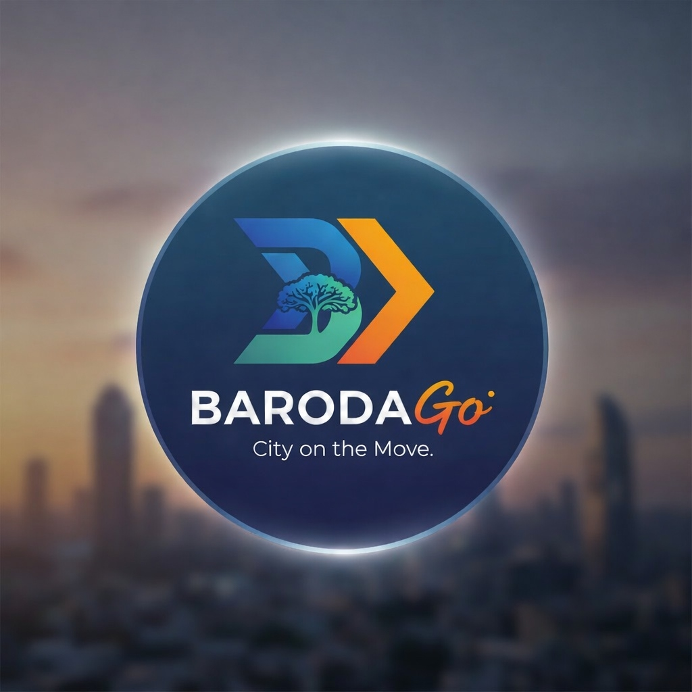

<p align="center">
  
</p>

# BarodaGo

*AI-Powered Municipal Infrastructure Platform for Vadodara*

---

## Overview

BarodaGo is a production-grade civic engagement platform designed to modernize municipal infrastructure management in Vadodara. The system features a triple-app ecosystem comprising a Citizen App, Admin Panel, and Worker App, powered by AI-driven incident triage, gamification mechanics, and community crowdfunding capabilities.

## Architecture

The platform follows a microservices architecture with three primary applications:

- **Citizen App** - Mobile application for incident reporting and community engagement
- **Admin Panel** - Web-based dashboard for municipal oversight and analytics  
- **Worker App** - Mobile application for field workers with task management

**Technology Stack**

*Frontend*: Flutter (Mobile), React with TypeScript (Web)  
*Backend*: FastAPI, PostgreSQL with PostGIS, Redis, RabbitMQ  
*AI/ML*: Google Gemini Vision, CLIP embeddings, ChromaDB  
*Infrastructure*: Docker, Kubernetes on GCP  
*Payments*: Razorpay with UPI integration

## Key Features

### Citizen Application

*One-Click Reporting* - Gesture-based camera interface with zero text input required  
*AI Triage* - Automatic incident categorization using Google Gemini Vision  
*Community Feed* - Ward-based feed displaying resolved municipal issues  
*Civic Crowdfunding* - Community-driven beautification project funding

### Administrative Panel

*Digital Twin* - Real-time 3D visualization of 19 VMC wards using Mapbox  
*AI Orchestration* - Intelligent task assignment based on proximity and resources  
*Policy Analytics* - Predictive insights for infrastructure planning

### Worker Application

*Mission Cards* - Optimized routes with Google Maps integration  
*AI Verification* - Before/after photo comparison using Siamese networks  
*Skill Leveling* - Gamified performance tracking with Banyan Points system

## Quick Start

### Prerequisites

- Node.js 18 or higher
- Python 3.11 or higher
- Docker and Docker Compose
- Flutter SDK 3.16 or higher

### Installation

**1. Clone and Configure**

```bash
git clone <repository-url>
cd BarodaGo
cp .env.example .env
```

Edit `.env` with your API keys and configuration.

**2. Start Infrastructure Services**

```bash
docker-compose up -d
```

**3. Setup Backend**

```bash
cd backend
python -m venv venv
source venv/bin/activate  # Windows: venv\Scripts\activate
pip install -r requirements.txt
alembic upgrade head
uvicorn main:app --reload
```

**4. Setup Admin Panel**

```bash
cd apps/admin
npm install
npm run dev
```

**5. Setup Flutter Applications**

```bash
cd apps/citizen
flutter pub get
flutter run
```

## Vadodara Ward Structure

BarodaGo operates using the official 19-ward structure of Vadodara Municipal Corporation:

1. Alkapuri | 2. Akota | 3. Manjalpur | 4. Productivity | 5. Gorwa  
6. Karelibaug | 7. Raopura | 8. Fatehgunj | 9. Sayajigunj | 10. Panigate  
11. Wadi | 12. Tandalja | 13. Harni | 14. Gotri | 15. Bapod  
16. Sama | 17. Vasna | 18. Waghodia | 19. Atladara

## Gamification System

**Banyan Points**

- Report submission: 10 points
- High-Five interaction: 1 point  
- Successful verification (workers): 50 points

**Leaderboards**

- Ward-wise citizen rankings
- Worker performance metrics
- Monthly champions

## Civic Crowdfunding

*Sanskari Sanchay* enables community-driven beautification projects:

1. Citizens tag infrastructure eyesores
2. Community voting (threshold: 100 votes)
3. Crowdfunding campaign activation
4. UPI contributions via Razorpay
5. Funds held in escrow
6. Release upon AI-verified completion

## Development

### Running Tests

```bash
# Backend
cd backend && pytest

# Admin Panel
cd apps/admin && npm test

# Flutter apps
cd apps/citizen && flutter test
```

### Database Migrations

```bash
cd backend
alembic revision --autogenerate -m "description"
alembic upgrade head
```

## API Documentation

Once the backend is running, access interactive documentation:

- Swagger UI: `http://localhost:8000/docs`
- ReDoc: `http://localhost:8000/redoc`

## Security

The platform implements enterprise-grade security measures:

- JWT-based authentication
- Firebase Auth integration
- Rate limiting on all endpoints
- Image sanitization and validation
- Encrypted payment processing

## License

MIT License - See LICENSE file for details

## Contributing

This is a municipal infrastructure project. For contributions, please contact Vadodara Municipal Corporation.

---

**Version 1.0.0** | Built for Vadodara
